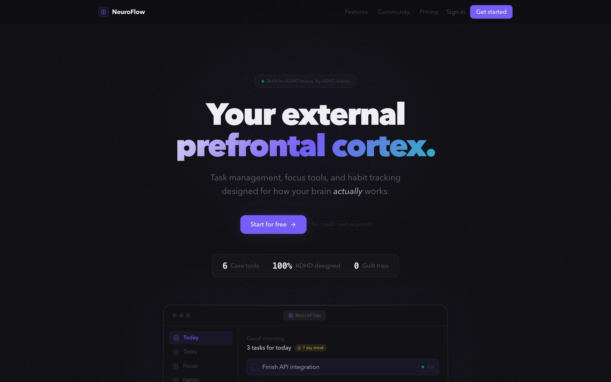

# NeuroFlow

**The external prefrontal cortex ADHD brains need.**


**[Live demo](https://neuroflow-gamma.vercel.app)**

---

## The Problem

Generic productivity apps assume a neurotypical brain: linear task lists, rigid schedules, willpower-based motivation. For the 5-10% of adults with ADHD, these tools don't just fall short — they actively backfire. Missed reminders pile up into shame spirals. Flat task lists offer no sense of where to start. And the dopamine deficit that defines ADHD means "just do it" motivation frameworks are fundamentally broken.

NeuroFlow is built around how ADHD brains actually work: variable energy levels, the need for external structure, dopamine-driven motivation, and the power of body doubling.

## Key Features

### Morning Planning with Energy Forecasting
Plan your day around *your* energy curve, not a generic 9-to-5. NeuroFlow maps your personal peak and dip windows, then slots high-demand tasks into peak hours and low-effort work into afternoon dips. An AI planner can auto-generate your entire daily schedule from your task list.

### AI Task Breakdown
Staring at "do taxes" and freezing? The AI coach breaks overwhelming tasks into concrete, physical next actions — each starting with a verb, each completable in under 30 minutes. "Open browser and navigate to IRS.gov" is something you can actually do. Powered by Claude.

### Focus Sessions with Parking Lot
A distraction-aware focus timer with ambient soundscapes (brown noise, rain, lo-fi). When a random thought interrupts your flow, toss it in the Parking Lot — a scratchpad that captures intrusive thoughts without breaking your session. Includes break reminders and hyperfocus alerts when you've overrun a time block.

### Dopamine Menu
A personalized catalog of healthy recharging activities organized by energy level (Wired / Okay / Low / Recharge). Quick Hits for 2-minute resets, Medium Resets for between-task breaks, Pair-with-Tasks for background stimulation, and Earned Rewards for completing hard things. Includes a randomized Quick Pick spinner when you can't decide.

### Body Doubling Rooms
Virtual co-working spaces where you can see others focusing in real time. Create or join rooms, see who's online, and tap into the accountability that comes from working alongside other people — the ADHD productivity hack that actually works.

### Gamification & Achievements
XP for completing tasks, finishing focus sessions, and checking in. Level progression, streak tracking, and unlockable achievements keep the dopamine loop positive. Focus session XP scales with completion ratio — finishing 80%+ of your planned time earns bonus rewards.

## Tech Stack

| Layer | Technology |
|---|---|
| Framework | Next.js 16 (App Router) |
| UI | React 19, Tailwind CSS 4, Framer Motion |
| State | Zustand |
| Backend | Supabase (Auth, Postgres, Realtime) |
| AI | Anthropic Claude API |
| Audio | Tone.js |
| Drag & Drop | dnd-kit |
| Language | TypeScript |

## Quick Start

```bash
git clone https://github.com/FelmonFekadu/neuroflow.git
cd neuroflow
pnpm install
cp .env.example .env.local
# Fill in your Supabase and Anthropic API keys in .env.local
pnpm dev
```

Open [http://localhost:3000](http://localhost:3000) in your browser.

## Architecture

```
src/
├── app/                    # Next.js App Router pages
│   ├── api/ai/             # AI endpoints (task breakdown, morning plan, coach nudge, reflection)
│   ├── api/auth/           # Auth routes (login, signup, magic link, password reset)
│   ├── api/gamification/   # Achievement checking
│   └── app/                # Authenticated app pages
│       ├── today/          # Dashboard — greeting, energy check-in, focus task, habits
│       ├── plan/           # Daily planner with energy forecast and time blocks
│       ├── tasks/          # Task inbox with AI breakdown and filtering
│       ├── focus/          # Focus timer with soundscapes and parking lot
│       ├── body-double/    # Virtual co-working rooms
│       ├── dopamine-menu/  # Recharge activity catalog
│       ├── habits/         # Habit tracker with streaks
│       ├── reflect/        # Evening reflection and insights
│       ├── achievements/   # XP, levels, and unlocked achievements
│       └── settings/       # Profile, ADHD preferences, accessibility
├── components/
│   ├── features/           # Feature-specific components
│   ├── layout/             # App shell, sidebar, navigation
│   └── ui/                 # Reusable design system primitives
├── hooks/                  # Custom hooks (energy state, game loop, audio engine)
├── stores/                 # Zustand stores (tasks, sessions, habits, daily plan, profile)
├── lib/                    # Utilities (Supabase clients, AI helpers, rate limiting)
└── types/                  # TypeScript type definitions
```

## Contributing

1. Fork the repository
2. Create a feature branch (`git checkout -b feature/your-feature`)
3. Commit your changes
4. Push to the branch and open a pull request

## License

[MIT](LICENSE)
